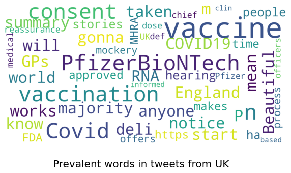
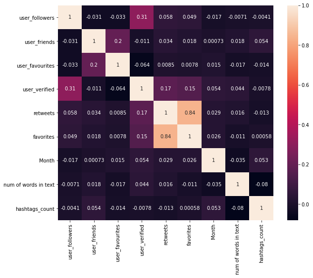

# Pfizer-Tweets-Analysis-and-Visualisations
## To explore the tweets about the new Pfizer & BioNTech vaccine to understand the public reception, the topics discussed, the positive and negative sentiments related to the vaccine.

**Author** : SHAILESH DHAMA

Study the subjects of recent tweets about the vaccine made in collaboration by Pfizer and BioNTech, perform various NLP tasks on this data source.
                
### Dataset :

The dataset consists of a csv file: vaccination_tweets.csv

## Approach:

### Data processing & Exploratory Data Analysis:

    1.Import Libraries
    2.Load Data
    3.Exploratory Data Analysis[EDA]
    4.Followers and Retweets
    5.Missing Values
    6.Unique Values
    7.Most frequent values
    8.Distribution of words in text column
    9.Data distribution
    10.Word-Clouds
    11.Hashtags
    12.Correlation
           
## RESULTS :

#### Types of Twitter accounts


#### Top-5 Sources (Platform) of tweets


#### Platform with maximum number of tweets


#### Day with maximum tweets


#### Top-10 users with maximum number of tweets


#### Top-10 locations with maximum number of users


#### Number of Followers and Retweets for each type of user


#### Places of missing values in column


#### Barplot for unique values in each column


#### Distribution of words in text column


#### Data distribution of Username


#### Data distribution of User Location


#### Data distribution of Tweet Source


#### Prevalent words in tweets


#### INDIA:


#### UNITED STATES:


#### UNITED KINGDOM:



#### CANADA:


#### Hashtags


#### Top-5 Hashtags


#### Hashtags per tweet


#### Prevalent words in hashtags


#### Correlation among various Numerical Features


### For further information:

Please review the narrative of our analysis in [our jupyter notebook](./Pfizer%20Tweets%20Analysis%20and%20Visualisations.ipynb)

For any additional questions, please contact **shaileshettyd@gmail.com)

##### Repository Structure:

```
├── README.md                                                                                                   <- The top-level README for reviewers
├── Pfizer%20Tweets%20Analysis%20and%20Visualisations.ipynb                                                     <- narrative documentation of analysis
├── vaccination_tweets.csv                                                                                      <- Dataset
└── images                                                                                                      <- generated from code
```
## Citing :

```
@misc{Shailesh:2020,
  Author = {Shailesh Dhama},
  Title = {Pfizer-Tweets-Analysis-and-Visualisations},
  Year = {2020},
  Publisher = {GitHub},
  Journal = {GitHub repository},
  Howpublished = {\url{https://github.com/ShaileshDhama/Pfizer-Tweets-Analysis-and-Visualisations}}
}
```
